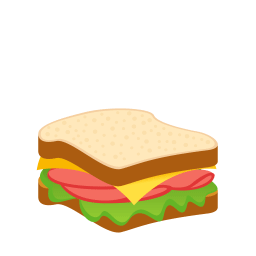

<!-- Md. Ali Ahnaf -->

<!--<head>
<link href="https://maxcdn.bootstrapcdn.com/font-awesome/4.3.0/css/font-awesome.min.css" rel="stylesheet">  
<link rel="stylesheet" href="assets/css/bootstrap-5.0.1-iso.css"> 
<link rel="stylesheet" href="assets/css/homepage1.css"> 
<link rel="stylesheet" href="https://cdnjs.cloudflare.com/ajax/libs/font-awesome/6.1.1/css/all.min.css"> 
</head>
<body>-->

   
  

  

    

      <a class="animate-charcter"> 
          

 <!--width="300" height="300"-->

       </a>
    

  

# &nbsp;👋 Hi there, I'm <a target="_blank" href="https://mdaliahnaf.github.io/"></a><&nbsp; 

- I’m interested in **Competitive Programming** and  currently focused on **Deep Learning-Computer Vision| Backend Web-App Developer | Machine Learning-Data Science |**
- I am a senior-year undergraduate student in from [American International University-Bangladesh (AIUB)](https://www.aiub.edu/) with a passion for problem-solving and computing.
- Previously, I played Dota 2 in the eSports scene of Bangladesh, and currently, I play Valorant professionally as an eSports player.   
- I am inevitably on the lookout for **opportunities** to hone my problem-solving skills through the creation of efficient **software solutions**, the development of **algorithms**, the design of resilient systems, or the optimization of performance with a significant impact. 
- I am concentrating on conducting **research** and developing cutting-edge initiatives on various **CNN sequential model** architectures within the field of deep learning. Moreover, I am constantly **improving** **my algorithms, problem-solving skills, data structures,** and **Oracle-SQL database**. 
And I love**cooking!**  

<!-- Details Section -->

    
 <samp>&#9776; Feel free to find me on</samp>

    

         
        <!-- Activity Widget -->
        
         
        <!-- Social Links -->
        
Find me on

        <!-- Mail -->
        
        <!-- Linkedin -->
        
        <!-- Twitter -->
          
        <!-- Youtube -->
        
        <!--- src="https://img.shields.io/badge/-Youtube-FF0000?style=flat-square&logo=Youtube&logoColor=white" --->  
    

 

 
 

#  &nbsp;Used Languages

#  &nbsp;Streak

#  &nbsp;Stats

- 📫 How to reach me- **aliahnaf2012@gmail.com**

<h3 align="left">Connect with me:</h3>

  
  
  
  
 <!---
  --->
  
  
  <!---
   --->

  

   <table>
      <tr>
       <th>My GitHub Stats</th>
       <th>Language Contribution</th>
     </tr>
      <tr>
       <td> </td>
       <td> </td>
     </tr>
   </table>

<h3 align="left">Languages and Tools:</h3>

 

   
   
 
     
      
    
     
 <!---  
  --->
   

